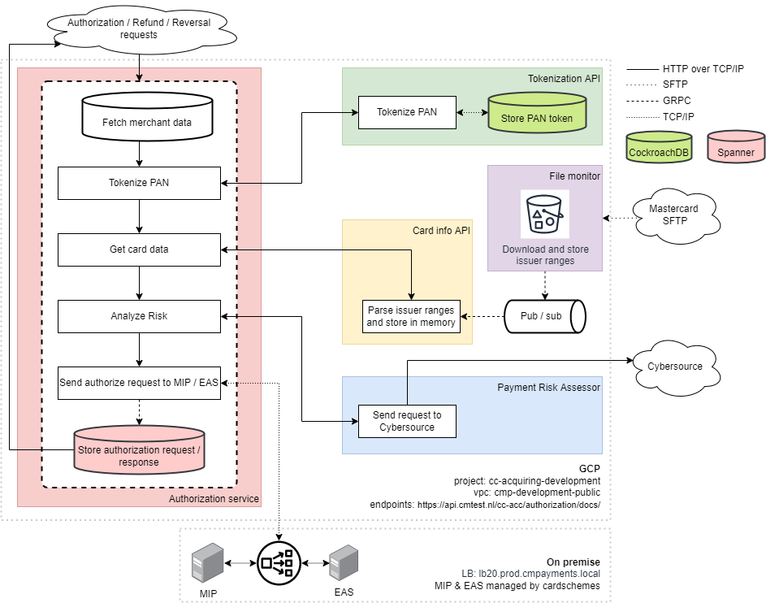

# Authorization

Manages everything related to the Authorization process of our Creditcard Processing Platform.

## Architecture

## Documentation
The API is documented in openAPI 3.0 specs. These specs are kept up-to-date manually and are served by the application. This is integrated in the pipeline. So if you change something in the API DON'T FORGET to update the specs as well.

## Run the application local
- Checkout and run (the Local Development repo)(https://gitlab.cmpayments.local/creditcard/infrastructure/local-development).
- Thats it. :)

### Integration tests
Integration tests are ran using [Insomnia](https://insomnia.rest/download), kept in sync using [Repo Sync Plugin v3](https://insomnia.rest/plugins/insomnia-plugin-repo-sync-3).

Use the "Import from File" feature to import `tests/Authorization API.json`; this will import the suite and setup the sync plugin.

To push your changes, use `Repo Sync - Export Workspace`. This will write your current workspace into `tests/Authorization API.json`. Now use `git` to share the changes with the team, the same as you do with code changes.

To load changes, use `Repo Sync - Import Workspace`.

In addition to creating the required API calls in the `debug` panel, setup "unit tests" in the `test` panel, including checking specific response fields.

#### VTS Setup
To version the VTS testcases, a different integration suite is created per section of the integration test. These are stored in `tests/visa/vts-vip/*.stf`

### Application Logic
All Application logic resides inside `./cmd/api/`. These files can be built into a binary which services a REST API that
can be used to Authorize Creditcard payments.

### Domain Logic
All Domain logic resides in `./internal/processing/`. This directory has a package for every functional vertical:

* [`authorize`](./internal/processing/authorization) manages the process of authorizing
* [`refund`](./internal/processing/refund) manages the process of authorizing a refund
* [`capture`](./internal/processing/capture) manages the process of proceeding to actually get the money
* [`reverse`](./internal/processing/reverse) manages the process of reversing a payment authorization

Each of these directories contains all the directly required code. It does not contain concrete implementations
that use external dependencies (eg database queries, API clients, etc), these are hidden behind `interfaces`.

Details of the functionality of each of these verticals is described in a dedicated readme file inside each directory.

### Supporting / Infrastructure Code
All code that isn't directly needed for the domain, but is needed to support the processes around the domain,
has its own directory inside `./internal/`. Some prominent examples include:

* `config` to manage PSP and Merchant configuration
* `mip` and `eas` to connect to the Mastercard and VISA network
* [`spanner`](./internal/infrastructure/spanner/README.md)

### Set human readable logging for development
Edit your run configuration and add `human_readable_logging=true` to the environment variables in config.yml.

### Connection pool
To support parallel requests and responses a connection pool is used to connect to the different payment networks. More
details about this component can be found here [connection pool](./internal/infrastructure/connection/readme.md)

### Setting up CORS
CORS setup can be found in cmd/api/middlewares.go. For local development we use http://frontend.dev.cmtest.nl:3000/. When developing in a CM-environment any *.dev.cmtest.nl path will resolve to localhost by default. This means that technically anything.dev.cmtest.nl would work, but we have decided to use frontend.dev.cmtest.nl. All CM APIs have this CORS-rule enabled by default, so you cannot access any of the CM APIs if you try to approach it via localhost:3000.

For acceptance and production, this value should be set to whatever the acceptance/production backoffice urls are. The values can be found in the config.yml.