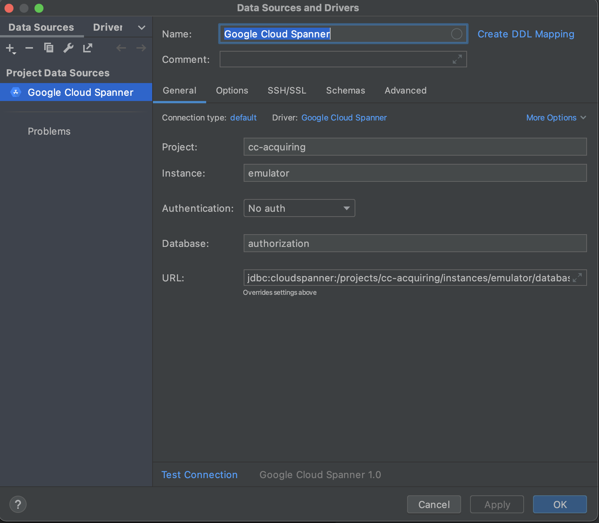
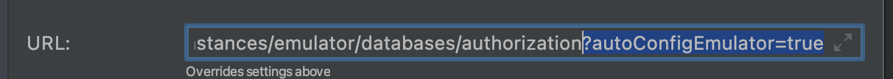
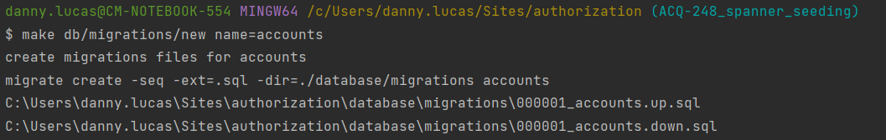

# Google Cloud Spanner

We use Spanner for data storage. To a large degree, Spanner acts like a RDBMS.
However, there are some things that we need to consider to get optimal performance.

## Database Design

*The design rules can now be found at https://cmcom.atlassian.net/wiki/spaces/CA/pages/995196948/Database+Design*

## Local emulator setup

For local development, Google provides an emulator that should be used instead of connecting to an actual Spanner instance.

Advantages of the emulator include being able to execute DDL quickly, working locally and not racking up costs.

For this part you need to have gcloud cli && make cli installed.

* **make CLI:**
    * For *Windows* you can install this via `choco install make`.
    * For *MacOS* you can install this via `brew install make`.
* **gcloud CLI**
    * For *Windows* follow this [link](https://cloud.google.com/sdk/docs/install#windows)
    * For *MacOS* follow this [link](https://cloud.google.com/sdk/docs/install#mac)


To use migrate to provision a Spanner database, the line endings in the migration files need te be LF. It will throw an error on CRLF.

To be able to run your applications against the Spanner emulator, you need to set ```SPANNER_EMULATOR_HOST=localhost:9010```. This is included in the migrations. In Goland you can add an environment variable to your run configuration OR you can start your application through ```make run/api```.

To start developing locally with Spanner as your DB you need to start the Spanner emulator. This is an in-memory tool, so you need to start and provision this each time you stop the emulator.
Therefor we created a Makefile which groups all commands together for you. This Makefile relies on environment variables.
So to have it working properly you need to *create an `.envrc` file in the root of the project* with the following variables:

```
export SPANNER_INSTANCE=emulator
export SPANNER_DATABASE=authorization
export GCLOUD_PROJECT=cc-acquiring
export SPANNER_EMULATOR_HOST=localhost:9010
```

Change the `database.dsn` name inside the [config.yml](config.yml) to reflect the right configuration you stored in the [.envrc](.envrc) file.
If you used the above configuration the `database.dsn` should be the following: `projects/cc-acquiring/instances/emulator/databases/authorization`

When connecting to the database via GoLand configure the Data sources and drivers properties the same as the [.envrc](.envrc) file.
It should look something like this:



*Next add the following line to the URL in Datasources and drivers properties when using the emulator: `?autoConfigEmulator=true`*



First you have to create a dedicated gcloud config once by running:

```shell
make gcloud/config/spanner/emulator/create
```

Then you can activate this config by executing:

```shell
make gcloud/config/activate name=emulator
```

Run the emulator, create an instance and a DB

```shell
make spanner/emulator/run
```

To create a new migration, run the following command and replace $1 with the name of the migration.
*example of a migration name: `create_accounts`*

*Migrations will be stored in [database/migrations](../../../database/migrations) folder*




```shell
make db/migrations/new name=$1
```

To run all the migrations

```shell
make db/migrations/up
```

To seed the database with test data run the following command:
*make sure every statement in the seed.sql ends with a semicolon*
```shell
make db/seed/up
```

To delete all test data from the database. *Edit the `dumpSeedData` [function](database/fixture/seed.go). Add the tables that need to be dumped.*

```shell
make db/seed/down
```